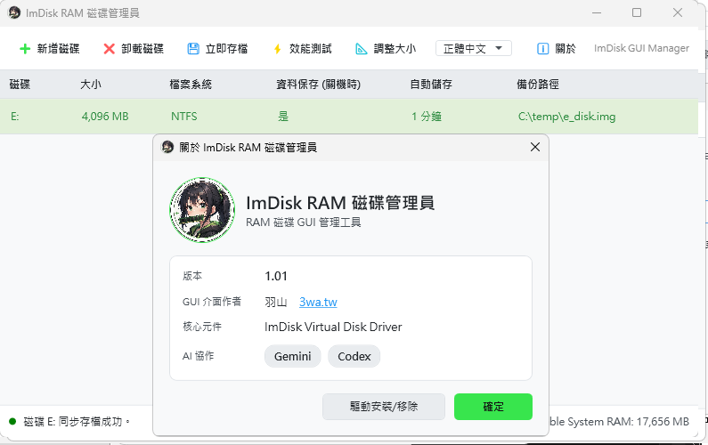
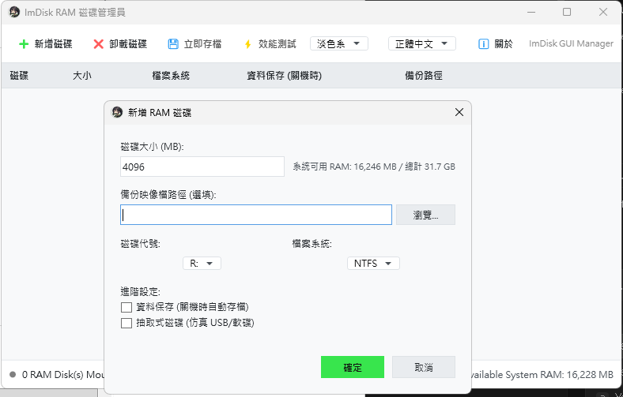
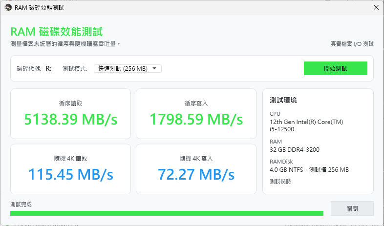
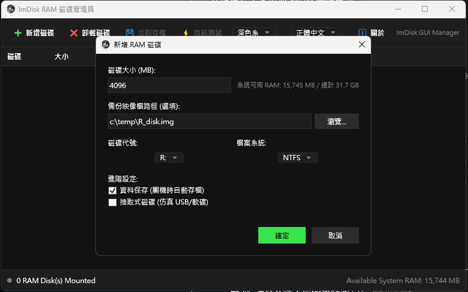

# ImDisk GUI 與 Driver Payload 編譯說明 (GUI Build & Driver Payload Instructions)

本專案已整合 C# WPF GUI 管理介面。GUI 與 driver payload 分開發佈，`ImDiskGui.exe` 只負責管理與呼叫 driver 安裝/移除流程，不再把 driver 合體進單一執行檔。

## 開發動機與設計亮點 (Motivation & Highlights)

### 💡 開發動機
原生的 ImDisk 是一款歷史悠久、穩定性極高的 Windows 虛擬磁碟驅動程式，但其自帶的控制台介面（imdisk.cpl）相對簡陋，且在使用上有一些不夠貼心的地方（例如卸載時若遇鎖定會直接報錯、重開機後清單殘留幽靈磁碟、缺少直觀的效能測試與資料保存設定等）。
為此，本專案基於 **WPF (C# .NET 4.8)** 進行了全新的「拉皮」與功能重構，旨在打造一個現代化、美觀且極度強健的虛擬硬碟管理工具。

### 🌟 設計亮點
* **極致美感與現代化主題**：導入了主流的深色/淺色/跟隨系統主題切換，搭配卡片式扁平化設計，字體也經過了嚴格的 DPI 與顏色同步校正。
* **強健的核心狀態對齊 (0-Ghosting)**：重寫底層 `imdisk.cpl` API 封送（P/Invoke），解決了原版計數索引錯位與字串封送崩潰的陳年 Bug，確保 GUI 清單與核心驅動狀態 100% 同步，電腦重開機後自動清理失效磁碟。
* **安全的核心層強拆機制**：當磁碟被進程鎖定無法正常解除掛載時，GUI 會自動獲取精確裝置編號，設置 `ForceDismount` 並透過核心 API 強拆，確保磁碟順利卸載且完全不彈出報錯。
* **視覺化記憶體效能評測**：內建 Benchmark 功能，免去另外開啟 CrystalDiskMark 的繁瑣，可即時量測極限循序與隨機 4K 讀寫吞吐，並同步監測 CPU、RAM 的本機規格資訊，版面加寬防切字。
* **分離式安全打包架構**：不再將 Driver payload 硬塞入 GUI 執行檔，降低被 Windows Defender 誤判攔截的機率，並將安裝與移除流程做精美的防呆與動態隱藏。

## 編譯與打包步驟

1. **下載官方已數位簽署的驅動包**：
   - 官方下載連結：[https://static.ltr-data.se/files/imdisk.zip](https://static.ltr-data.se/files/imdisk.zip) (或 [https://www.ltr-data.se/files/imdiskinst.zip](https://www.ltr-data.se/files/imdiskinst.zip))
2. **放置檔案**：
   - 將下載好的 `imdisk.zip` (或 `imdiskinst.zip`) 直接放入此專案的根目錄 `d:\mytools\ImDisk\`。
3. **執行編譯與 payload 整理**：
   - 執行根目錄的 [auto_build_gui.bat](file:///D:/mytools/ImDisk/auto_build_gui.bat)。
   - 指令檔會自動執行：
     - 計算並顯示該 ZIP 的 **SHA-256 哈希值**。
     - 解壓縮並透過 Windows Authenticode 驗證 `sys\amd64\imdisk.sys` 是否由作者 **Olof Lagerkvist** / **LTR Data** 所數位簽署。
     - 驗證成功後，將 binaries 整理到獨立的 `driver\` 目錄，供 GUI 的安裝/移除功能使用。
     - x64 安裝段仍會使用 `cli\i386` 與 `cpl\i386` helper，發佈時請保留完整 `driver\` 結構。
     - `uninstall_imdisk.cmd` 會與 `ImDiskGui.exe` 同層發佈。
     - 編譯產出的執行檔與套件將存放在 [ImDiskGui\bin\x64\Release\net48](file:///D:/mytools/ImDisk/ImDiskGui/bin/x64/Release/net48) 目錄。
     - 發佈與分發時，請提供該目錄下的 `ImDiskGui.exe`、`uninstall_imdisk.cmd` 與整個 `driver\` 目錄。

## ImDisk GUI 主要功能特性 (GUI Features)

* **現代化主題介面**：基於 WPF 打造的精美 UI，支援深色、淺色與跟隨系統主題，中英文介面無縫切換。
* **強健的狀態同步與強制解除掛載**：
  - 開機或重新載入時自動透過 Windows 底層 API 與真實驅動狀態同步，防止幽靈磁碟殘留。
  - 對於檔案被鎖定的虛擬硬碟，內建 `ForceDismount` 與強制核心卸載 API，確保卸載成功不報錯。
* **內建效能測試 (Benchmark)**：
  - 支援快速、標準與壓力測試，直觀呈現虛擬記憶體磁碟的循序與 4K 隨機寫入/讀取吞吐量。
  - 同步檢視本機 CPU 與系統記憶體狀態。
* **背景防呆驅動管理**：
  - 動態識別驅動載入狀態，智能隱藏目前不可用的操作按鈕（例如安裝完即自動隱藏安裝按鈕並轉為移除按鈕），防止二次操作。
  - 免重啟自動重載介面：一旦驅動安裝完成即可直接進入主畫面。
* **無痛資料存檔與定時同步**：開關機、登出、手動卸載與立即存檔時可安全同步資料，並可在資料保存模式中設定 `1`、`3`、`5`、`10`、`30`、`60` 分鐘自動儲存；定時同步會先檢查 `IMDISK_IMAGE_MODIFIED`，只有資料真的變更才寫回映像檔。
* **既有映像檔精準還原**：選擇既有 `.img` / `.bin` 備份檔時，會自動偵測實際檔案大小並以精準 byte 數掛載，避免 MB 換算造成截斷或大小錯位。

## 資料保存與映像檔同步機制 (Data Preservation & Image Sync)

為了兼顧記憶體磁碟的極致效能、實體硬碟的壽命，以及使用者資料的安全性，本專案實作了一套健壯且透明的資料保存與備份同步機制：

### 1. 同步原理與方法
* **完整磁碟映像備份 (Full disk image)**：同步時，程式會開啟虛擬磁碟裝置控制代碼（例如 `\\.\R:`），先呼叫 Windows 核心 API `FlushFileBuffers` 將 Dirty Pages 排空回 RAM 磁碟，再透過 ImDisk 原生 `ImDiskSaveImageFile` 儲存完整磁碟映像，保留分割表、檔案系統與所有底層結構。
* **原子寫入 (Atomic Swap)**：寫入時會先將資料寫入暫存檔（例如 `backup.img.tmp`）。只有當整份資料 100% 完整複製且排空檔案快取後，才會刪除舊的 `.img` 檔並將 `.tmp` 重新命名。這能確保若在存檔過程中遭遇斷電或異常，原本已備份好的舊映像檔絕對不會損毀。
* **Dirty Flag 重置**：映像檔成功替換後，程式會透過 `IOCTL_IMDISK_SET_DEVICE_FLAGS` 清除 `IMDISK_IMAGE_MODIFIED` 標記，讓下一輪定時同步能精準判斷是否真的有新資料需要寫回。
* **開機載入與大小偵測 (Restore)**：當程式啟動或掛載時，若設定的備份映像檔存在，ImDisk 驅動程式會直接讀取該 `.img` 檔並將其內容載入至分配的記憶體中。新增磁碟時若選到既有映像檔，GUI 也會自動帶入該檔案的實際大小，避免還原時發生截斷或額外補零。

### 2. 自動同步頻率與時機
* **預設手動、可選定時**：資料保存模式預設為 `手動 (無定時)`，不會主動背景循環寫入。若需要更即時的保存，可在新增磁碟時設定 `1分鐘`、`3分鐘`、`5分鐘`、`10分鐘`、`30分鐘` 或 `60分鐘` 的自動儲存間隔。
* **智慧變更偵測 (Dirty Check)**：定時同步不是盲目寫入；當指定間隔到達時，程式會先查詢核心驅動的 `IMDISK_IMAGE_MODIFIED` 標記。只有虛擬磁碟確實被寫入/修改過，才會執行備份，若資料沒有變動就只更新檢查時間，避免無謂 SSD 寫入。
* **觸發式同步時機**：
  1. **系統關機/重啟**：當作業系統關機或重啟時，GUI 會監聽 Windows 關機事件並**同步阻塞**儲存所有已掛載的資料保存記憶碟。
  2. **工作階段結束 (使用者登出)**：使用者登出或 Windows Session 結束時亦會自動觸發存檔。
  3. **手動卸載**：當使用者在 GUI 中點擊「卸載磁碟」時，程式會先自動執行一次同步，確認存檔無誤後再安全解除掛載。
  4. **手動立即存檔**：使用者可在主畫面的工具列隨時點擊「💾 立即存檔」按鈕進行即時備份。

### 3. 安全性與安全信任度
* **斷電與藍屏（BSOD）風險**：因為本質上是記憶體碟，若遭遇突發性斷電、Windows 藍屏當機等未經正常關機程序的異常，**所有自上次手動、觸發式或定時同步以來新寫入的資料皆會遺失**。若您正在進行重要工作，強烈建議在關鍵時刻隨手點擊工具列的「立即存檔」，或依需求啟用較短的自動儲存間隔。
* **映像檔完好性保證**：由於使用了「原子寫入」機制，即使存檔過程中系統崩潰，也只會遺留一個未完成的 `.tmp` 檔案，原有的備份映像檔仍會保持在「上一次存檔成功」的完好狀態，不會因此而損壞。
* **實體儲存安全**：定時同步採用 Dirty Check，資料未變更時不寫入備份檔；若不需要定時存檔，也可維持 `手動 (無定時)`，最大限度降低 SSD 寫入壓力。

## 常見問答 (FAQ)

### Q1：如果開啟了「資料保存模式」，為什麼主畫面的「效能測試」按鈕是灰色的（無法點選）？
* **A**：這**並非**因為資料保存模式限制了效能測試，而是因為該虛擬磁碟目前在 Windows 中**尚未掛載 (Offline)**（例如電腦剛重新啟動）。
  * 由於 RAM 磁碟是基於記憶體的易失性媒介，當系統重開機時，虛擬磁碟會消失。雖然 GUI 還留有設定檔，但此時 Windows 中並無該磁碟（狀態列會顯示 `0 RAM Disk(s) Mounted`）。
  * 由於沒有實體的磁碟機路徑，測試程式自然無法進行讀寫測試。**只要雙擊該欄位重新掛載，或是當管理程式啟動自動掛載後，按鈕便會恢復可用**。

### Q2：資料保存模式有設定「定時自動同步」的時間嗎？
* **A**：**在 1.01 版本中，我們新增了「資料自動儲存時間」定時同步功能！**
  * **支援設定**：使用者可以在新增磁碟時選擇自動儲存的時間間隔，包含 `1分鐘`、`3分鐘`、`5分鐘`、`10分鐘`、`30分鐘`、`60分鐘`，或選擇 `手動 (無定時)`。
  * **智慧髒標記 (Dirty Flag) 偵測**：定時同步並不是盲目寫入，以避免損害 SSD。程式會定期透過驅動核心查詢 `IMDISK_IMAGE_MODIFIED` 標記。**只有在虛擬磁碟確實被寫入/變更過資料時，才會執行備份**。若磁碟內資料無任何變動，定時器便不會觸發寫入，完美兼顧便利與 SSD 壽命保護。
  * **額外同步時機**：除了定時同步外，程式在**「系統關機/重新啟動」**、**「使用者工作階段結束/登出」**，以及**「手動於 GUI 解除掛載」**時依舊會執行安全同步。您也可以隨時點選主畫面工具列的「💾 立即存檔」手動即時備份。

### Q3：如果我卸載了有備份映像檔的磁碟，之後要如何重新掛載回來使用？
* **A**：
  1. 點擊 **「新增磁碟」** 按鈕。
  2. 在 **「備份映像檔路徑 (選填)」** 點擊 **「瀏覽...」** 選擇您原本儲存的 `.img` 備份檔。
  3. 勾選 **「資料保存 (關機時自動存檔)」**。
  4. 輸入大小與磁碟代號，點擊 **「確定」** 即可。底層驅動會自動載入備份檔中的檔案與分割區，不需要重新格式化，完美還原資料。

## 介面展示 (UI Screenshots)

### 1. 主管理介面 (Main Window - Light Theme)

### 2. 驅動維護面板 (Maintenance Window)

### 3. 效能測試面板 - 淺色模式 (Benchmark - Light Theme)

### 4. 效能測試面板 - 深色模式 (Benchmark - Dark Theme)

### 5. 新增磁碟對話框 (Add Disk Dialog)

---

# ImDisk Virtual Disk Driver for Windows NT/2000/XP/2003/Vista/7/8/8.1/10

PLEASE NOTE: This project is not recommended on recent versions of Windows
and many applications written for Windows Vista and later require features
that are not supported. It is based on an old design for compatibility with
as old versions as Windows NT 3.51. No new features will be added to this
project but it will remain available here because it could still be useful in
certain scenarios.

I will continue development of Arsenal Image Mounter instead. That has a
different design and emulates complete disks and is compatible with most
cases where physical disk are normally used.
https://github.com/ArsenalRecon/Arsenal-Image-Mounter

Back to this project, ImDisk Virtual Disk driver.
This driver emulates harddisk partitions, floppy drives and CD/DVD-ROM drives
from disk image files, in virtual memory or by redirecting I/O requests
somewhere else, possibly to another machine, through a co-operating user-mode
service, ImDskSvc.

To install this driver, service and command line tool, right-click on the
imdisk.inf file and select 'Install'. To uninstall, use the Add/Remove
Programs applet in the Control Panel.

You can get syntax help to the command line tool by typing just imdisk
without parameters.

I have tested this product under 32-bit versions of Windows NT 3.51, NT 4.0,
2000, XP, Server 2003, Vista, 7, 8, 8.1 and 10 and x86-64 versions of XP,
Server 2003, Vista, 7, 8, 8.1 and 10. Primary target are older versions and
there are several known compatibility issues on modern version of Windows.
Please see website for more details: https://ltr-data.se/opencode.html#ImDisk

The install/uninstall routines do not work under NT 3.51. If you want to use
this product under NT 3.51 you have to manually add registry entries needed
by driver and service or use resource kit tools to add necessary settings.

To install/uninstall on ARM or ARM64 architectures a manual setup is needed.
More about that and other frequently asked questions in the wiki:
https://github.com/LTRData/ImDisk/wiki

  Copyright (c) 2005-2021 Olof Lagerkvist
  https://www.ltr-data.se      olof@ltr-data.se

  Permission is hereby granted, free of charge, to any person
  obtaining a copy of this software and associated documentation
  files (the "Software"), to deal in the Software without
  restriction, including without limitation the rights to use,
  copy, modify, merge, publish, distribute, sublicense, and/or
  sell copies of the Software, and to permit persons to whom the
  Software is furnished to do so, subject to the following
  conditions:

  The above copyright notice and this permission notice shall be
  included in all copies or substantial portions of the Software.

  THE SOFTWARE IS PROVIDED "AS IS", WITHOUT WARRANTY OF ANY KIND,
  EXPRESS OR IMPLIED, INCLUDING BUT NOT LIMITED TO THE WARRANTIES
  OF MERCHANTABILITY, FITNESS FOR A PARTICULAR PURPOSE AND
  NONINFRINGEMENT. IN NO EVENT SHALL THE AUTHORS OR COPYRIGHT
  HOLDERS BE LIABLE FOR ANY CLAIM, DAMAGES OR OTHER LIABILITY,
  WHETHER IN AN ACTION OF CONTRACT, TORT OR OTHERWISE, ARISING
  FROM, OUT OF OR IN CONNECTION WITH THE SOFTWARE OR THE USE OR
  OTHER DEALINGS IN THE SOFTWARE.

  This software contains some GNU GPL licensed code:
  - Parts related to floppy emulation based on VFD by Ken Kato.
    https://web.archive.org/web/20100902032534/http://chitchat.at.infoseek.co.jp:80/vmware/vfd.html
  Copyright (C) Free Software Foundation, Inc.
  Read gpl.txt for the full GNU GPL license.

  This software may contain BSD licensed code:
  - Some code ported to NT from the FreeBSD md driver by Olof Lagerkvist.
    https://www.ltr-data.se
  Copyright (c) The FreeBSD Project.
  Copyright (c) The Regents of the University of California.
